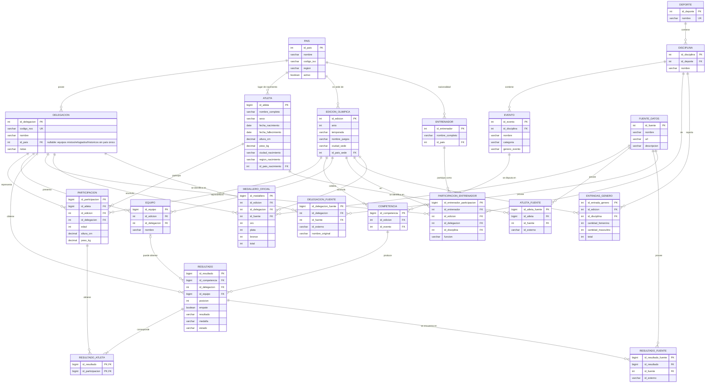

# Diagrama ER — Base de datos unificada de Olimpiadas

## Mapeo de fuentes de datos a entidades

| Fuente | Contenido principal | Entidades que alimenta |
|---|---|---|
| 1. KeithGalli/Olympics-Dataset (Tokio 2020) | Athletes, Coaches, EntriesGender, Medals, Teams | ATLETA, **ENTRENADOR**, **ENTRADAS_GENERO**, EQUIPO, RESULTADO |
| 2. Kaggle 120 years (athlete_events.csv + noc_regions.csv) | Atleta + participación + evento + medalla, por fila, 1896–2016 | ATLETA, PARTICIPACION, DELEGACION, DEPORTE/DISCIPLINA/EVENTO, RESULTADO |
| 3. Kaggle summer-olympics-medals-1896-2024 | Medallero agregado por país/edición (oro/plata/bronce/total) | **MEDALLERO_OFICIAL** (dato agregado, no granular) |
| 4. DataCamp r-olympics | Dataset tipo "120 years" (solapa con fuente 2) | ATLETA, PARTICIPACION, RESULTADO (reconciliar duplicados vía FUENTE_DATOS) |
| olympics.com | Referencia de calidad (verificación cruzada) | Usado para validar MEDALLERO_OFICIAL y RESULTADO durante el ETL, no requiere tabla propia |

La fuente 3 es agregada (país-edición), mientras que 2 y 4 son granulares (atleta-evento). Por eso el modelo mantiene **RESULTADO** (granular, calculado) separado de **MEDALLERO_OFICIAL** (reportado por la fuente/oficial), lo que permite comparar "medallero calculado desde RESULTADO" contra "medallero oficial reportado" — justo el control de calidad que pide el enunciado contra olympics.com.

## Diagrama ER

## Cambios respecto a la versión anterior

- **ENTRENADOR / PARTICIPACION_ENTRENADOR** (nuevo): la fuente 1 trae `Coaches.csv` con entrenador, país, disciplina y función; sin estas tablas ese archivo no tenía dónde cargarse.
- **ENTRADAS_GENERO** (nuevo): cubre `EntriesGender.csv` (cupos femeninos/masculinos por disciplina y edición), útil para reportes de participación por género que probablemente se pidan en clase.
- **MEDALLERO_OFICIAL** (nuevo): separa el medallero *agregado y reportado* (fuente 3, y cruzable contra olympics.com) del medallero *calculado* a partir de RESULTADO. Sin esto, la fuente 3 no encajaba en un modelo pensado solo a nivel de resultado individual, y se perdía la posibilidad de hacer el control de calidad de datos que pide el enunciado.
- **DELEGACION_FUENTE** (nuevo): igual que ATLETA_FUENTE/RESULTADO_FUENTE, pero para reconciliar cómo cada fuente nombra/identifica a una misma delegación (p. ej. "Russia" vs "ROC" vs "Russian Federation" vs "EUN").
- **RESULTADO_ATLETA**: se hizo explícita la llave primaria compuesta (`id_resultado`, `id_participacion`); antes no tenía PK declarada.
- **DELEGACION.id_pais**: documentado como nulable — hay NOCs (equipos mixtos, refugiados, URSS, Alemania unificada, etc.) que no corresponden a un único país actual.

## Cómo soporta esto los stored procedures pedidos

- **d) SP por atleta** (`ATLETA` → `PARTICIPACION` → `RESULTADO_ATLETA` → `RESULTADO` → `COMPETENCIA` → `EVENTO`/`DISCIPLINA`/`DEPORTE`, y `PARTICIPACION.id_delegacion` → `DELEGACION`/`PAIS`): permite listar participaciones, resultados y medallas de un atleta, con filtros opcionales por deporte, país (vía delegación) y año (vía `EDICION_OLIMPICA.anio`).
- **e) SP por país**: `DELEGACION` (filtrando por `id_pais`, agregando todas las delegaciones históricas asociadas a ese país si aplica) → `PARTICIPACION` (años de participación), `RESULTADO`/`MEDALLERO_OFICIAL` (medallas), y `PAIS` → `EDICION_OLIMPICA` (`id_pais_sede`) para determinar si ha sido sede y en qué años.

## Consideraciones para la implementación física

- Durante el ETL se necesitará un *crosswalk* manual (no modelado como tabla permanente) para unificar nombres de deporte/disciplina/evento entre fuentes, dado que su cardinalidad es baja (~50 deportes) y no justifica una tabla de reconciliación como las de atleta/resultado/delegación.
- Al cargar la fuente 4 (DataCamp, que replica la estructura de la fuente 2), deduplicar atletas/resultados usando `ATLETA_FUENTE`/`RESULTADO_FUENTE` antes de insertar, para no duplicar participaciones ya cargadas desde la fuente 2.
- `MEDALLERO_OFICIAL` debe cargarse por edición+delegación+fuente (incluyendo una fuente "olympics.com" si se captura manualmente para validar), permitiendo comparar contra el conteo agregado por `SUM()` sobre `RESULTADO`.
