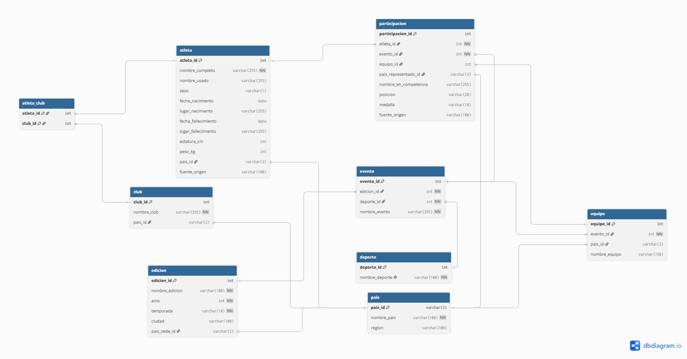

# Informe Técnico

## 1. Fuentes de datos y mapeo hacia el modelo

| Fuente | Archivo extraído | Contenido principal | Entidades que alimenta |
|--------|------------------|---------------------|------------------------|
| Olympics Dataset by KeithGalli | bios.csv | Datos biográficos del atleta (nombre, nacimiento, medidas y afiliaciones) | atleta, club, atleta_club y pais |
| Olympics Dataset by KeithGalli | results.csv | Resultado por evento/atleta (posición, medalla, disciplina) | participacion, evento, deporte, edicion, equipo |
| 120 years of olympic history athletes and results by heesoo37 | athlete_events.csv | Un renglón por atleta-evento con edad/altura/peso, equipo, año, ciudad, deporte, medalla | atleta, participacion, evento, edicion, deporte, equipo, pais |
| Summer Olympics Medals (1896-2024) by stefanydeoliveira | olympics_dataset.csv | Registro histórico de Verano 1896–2024, deporte/evento/medalla | participacion, evento, deporte, edicion |
| datasets olympics by datacamp | datalab_export.csv | Dataset "Olympics" de R (ciudad, año, deporte, atleta, país, género, evento, medalla) | participacion, evento, deporte, edicion, atleta |

**Nota sobre bios.csv y results.csv:** según el propio repositorio de KeithGalli, ambos
archivos provienen de [olympedia.org](https://www.olympedia.org/) y se relacionan
entre sí por `athlete_id`. Esa llave es la que se preserva como `atleta_id` (litearlmente
lo pasamos a español) en el modelo unificado (con reasignación de IDs al momento de la carga,
ya que cada fuente trae su propio identificador).

Como las cuatro fuentes describen el mismo dominio con columnas distintas
(`Sport` vs. `Discipline`, `Team` vs. `NOC`, `Pos` vs. `Rank`, etc.), el modelo
que sigue es la **capa de integración**: cada fuente se transforma (ETL) hacia
este esquema común antes de cargarse a la base de datos relacional.

## 2. Entidades

### 2.1 pais
Representa un Comité Olímpico Nacional (NOC) o país participante (una sede).

| Atributo    | Tipo         | Descripción            | Llave |
|-------------|--------------|------------------------|-------|
| pais_id     | varchar(3)   | Código NOC             | PK    |
| nombre_pais | varchar(100) | Nombre del NOC         | -     |
| region      | varchar(100) | Agrupación continental | -     |

### 2.2 atleta
Un deportista individual, con sus datos biográficos.

| Atributo            | Tipo         | Descripción                                            | Llave |
|---------------------|--------------|--------------------------------------------------------|-------|
| atleta_id           | int          | Identificador interno del atleta                       | PK    |
| nombre_completo     | varchar(255) | Nombre completo (bios.csv: Full name)                  | -     |
| nombre_usado        | varchar(255) | Nombre con el que se le conoce (bios.csv: Used name)   | -     |
| sexo                | varchar(1)   | M / F                                                  | -     |
| fecha_nacimiento    | date         | fecha                                                  | -     |
| lugar_nacimiento    | varchar(255) | dirección de nacimiento                                | -     |
| fecha_fallecimiento | date         | Nulo si aplica                                         | -     |
| lugar_fallecimiento | varchar(255) | Nulo si aplica                                         | -     |
| estatura_cm         | int          | De Measurements en bios.csv                            | -     |
| peso_kg             | int          | De Measurements en bios.csv                            | -     |
| pais_id             | varchar(3)   | Nacionalidad principal declarada                       | FK    |
| fuente_origen       | varchar(100) | CSV(s) desde donde se cargó/reconcilió el registro     | -     |

### 2.3 edicion
Una edición específica de los Juegos Olímpicos (ej. "1924 Summer Olympics").

| Atributo          | Tipo          | Descripción                 | Llave |
|-------------------|---------------|-----------------------------|-------|
| edicion_id        | int           | identificador               | PK    |
| nombre_edicion    | varchar(100)  | Ej. 1924 Summer Olympics    | -     |
| anio              | int           | Año de celebración          | -     |
| temporada         | varchar(10)   | Verano / Invierno           | -     |
| ciudad            | varchar(100)  | Ciudad sede                 | -     |
| pais_sede_id      | varchar(3)    | País sede de esa edición    | FK    |

### 2.4 deporte
Catálogo de deportes/disciplinas (unifica `Sport` y `Discipline` de las fuentes).

| Atributo          | Tipo          | Descripción                     | Llave |
|-------------------|---------------|---------------------------------|-------|
| deporte_id        | int           | identificador                   | PK    |
| nombre_deporte    | varchar(100)  | Nombre normalizado del deporte  | -     |

### 2.5 evento
Una prueba específica dentro de un deporte, en una edición determinada
(ej. "Singles, Men" de Tenis en 1924).

| Atributo        | Tipo          | Descripción                 | Llave |
|-----------------|---------------|-----------------------------|-------|
| evento_id       | int           | Identificador del evento    | PK    |
| edicion_id      | int           | Edición a la que pertenece  | FK    |
| deporte_id      | int           | Deporte al que pertenece    | FK    |
| nombre_evento   | varchar(255)  | Nombre de la prueba/evento  | -     |

### 2.6 equipo
Agrupa a los atletas que compitieron como escuadra/selección/dupla en un
evento puntual (relevos, dobles, deportes de equipo). Permite modelar
resultados grupales sin duplicar el resultado por cada atleta.

| Atributo        | Tipo          | Descripción                                                   | Llave |
|-----------------|---------------|---------------------------------------------------------------|-------|
| equipo_id       | int           | identificador del equipo                                      | PK    |
| evento_id       | int           | Evento en el que compitió ese equipo                          | FK    |
| pais_id         | varchar(3)    | País/selección que representa (nulo si es equipo mixto/club)  | FK    |
| nombre_equipo   | varchar(150)  | Nombre del equipo tal como aparece en la fuente               | -     |

### 2.7 club
Club o institución a la que estuvo afiliado un atleta (bios.csv: `Affiliations`).

| Atributo      | Tipo          | Descripción                         | Llave |
|---------------|---------------|-------------------------------------|-------|
| club_id       | int           | identificador del club/affliations  | PK    |
| nombre_club   | varchar(255)  | nombre del club/affiliations        | -     |
| pais_id       | varchar(3)    | País del club, si se conoce         | FK    |

### 2.8 atleta_club
Tabla puente ya que un atleta puede haber pertenecido a varios clubes a lo largo
de su carrera, y un club tiene varios atletas afiliados.

| Atributo    | Tipo  | Descripción                           | Llave     |
|-------------|-------|---------------------------------------|-----------|
| atleta_id   | int   | identificador de atleta               | Compuesta |
| club_id     | int   | identificador del club/affiliations   | Compuesta |

### 2.9 participacion
Cada renglón es la participación de un atleta en un evento (equivalente a un
renglón de `results.csv` o `athlete_events.csv`).

| Atributo              | Tipo          | Descripción                                                   | Llave     |
|-----------------------|---------------|---------------------------------------------------------------|-----------|
| participacion_id      | int           | identificador                                                 | PK        |
| atleta_id             | int           | Atleta que participó                                          | FK        |
| evento_id             | int           | Evento en el que participó                                    | FK        |
| equipo_id             | int           | Equipo/escuadra, si aplica                                    | FK o nulo |
| pais_representado_id  | varchar(3)    | NOC bajo el cual compitió en esa participación                | FK        |
| nombre_en_competencia | varchar(255)  | Nombre bajo el que compitió (results.csv: As)                 | -         |
| posicion              | varchar(20)   | Posición final, admite valores no numéricos (=17, DNS, DNF)   | -         |
| medalla               | varchar(10)   | Oro / Plata / Bronce / nulo si no hubo medalla                | -         |
| fuente_origen         | varchar(100)  | CSV de origen de ese registro                                 | -         |

**Nota:** en `pais_representado_id` puede diferir de `atleta.pais_id` si cambió de nacionalidad deportiva, por eso se hace énfasis sobre a participación.

## 3. Relaciones y cardinalidad

| Entidad A | Entidad B     | Cardinalidad  | Descripción                                                                                                                 |
|-----------|---------------|---------------|-----------------------------------------------------------------------------------------------------------------------------|
| pais      | atleta        | 1:N           | Un país es la nacionalidad de muchos atletas, un atleta tiene un país de nacionalidad principal                             |
| pais      | edicion       | 1:N           | Un país puede haber sido sede de varias ediciones, una edición tiene un único país sede                                     |
| pais      | equipo        | 1:N           | Un país puede tener muchos equipos (uno por evento en el que compitió), un equipo representa a un solo país                 |
| pais      | club          | 1:N           | Un país puede tener muchos clubes registrados, un club pertenece a un país                                                  |
| pais      | participacion | 1:N           | Un país es representado en muchas participaciones, cada participación se hace bajo un solo país                             |
| edicion   | evento        | 1:N           | Una edición agrupa muchos eventos, un evento pertenece a una sola edición                                                   |
| deporte   | evento        | 1:N           | Un deporte agrupa muchos eventos, un evento pertenece a un solo deporte                                                     |
| evento    | equipo        | 1:N           | Un evento puede tener varios equipos inscritos, un equipo compite en un solo evento                                         |
| evento    | participacion | 1:N           | Un evento tiene muchas participaciones (una por atleta), una participación ocurre en un solo evento                         |
| equipo    | participacion | 1:N           | Un equipo agrupa las participaciones de varios atletas, una participación pertenece a lo sumo a un equipo (individual nulo) |
| atleta    | participacion | 1:N           | Un atleta tiene muchas participaciones a lo largo de su carrera, una participación corresponde a un solo atleta             |
| atleta    | club          | N:M           | Un atleta puede pertenecer a varios clubes, un club tiene varios atletas afiliados                                          |

## 4. Diagrama ER

El siguiente es el código utilizado para modelar la base de datos en [dbdiagram](https://dbdiagram.io/)

```
Table pais {
  pais_id varchar(3) [pk]
  nombre_pais varchar(100) [not null]
  region varchar(100)
}

Table atleta {
  atleta_id int [pk, increment]
  nombre_completo varchar(255) [not null]
  nombre_usado varchar(255)
  sexo varchar(1)
  fecha_nacimiento date
  lugar_nacimiento varchar(255)
  fecha_fallecimiento date
  lugar_fallecimiento varchar(255)
  estatura_cm int
  peso_kg int
  pais_id varchar(3) [ref: > pais.pais_id]
  fuente_origen varchar(100)
}

Table edicion {
  edicion_id int [pk, increment]
  nombre_edicion varchar(100) [not null]
  anio int [not null]
  temporada varchar(10) [not null]
  ciudad varchar(100)
  pais_sede_id varchar(3) [ref: > pais.pais_id]
}

Table deporte {
  deporte_id int [pk, increment]
  nombre_deporte varchar(100) [not null, unique]
}

Table evento {
  evento_id int [pk, increment]
  edicion_id int [not null, ref: > edicion.edicion_id]
  deporte_id int [not null, ref: > deporte.deporte_id]
  nombre_evento varchar(255) [not null]
}

Table equipo {
  equipo_id int [pk, increment]
  evento_id int [not null, ref: > evento.evento_id]
  pais_id varchar(3) [ref: > pais.pais_id]
  nombre_equipo varchar(150)
}

Table club {
  club_id int [pk, increment]
  nombre_club varchar(255) [not null]
  pais_id varchar(3) [ref: > pais.pais_id]
}

Table atleta_club {
  atleta_id int [ref: > atleta.atleta_id]
  club_id int [ref: > club.club_id]

  indexes {
    (atleta_id, club_id) [pk]
  }
}

Table participacion {
  participacion_id int [pk, increment]
  atleta_id int [not null, ref: > atleta.atleta_id]
  evento_id int [not null, ref: > evento.evento_id]
  equipo_id int [ref: > equipo.equipo_id]
  pais_representado_id varchar(3) [ref: > pais.pais_id]
  nombre_en_competencia varchar(255)
  posicion varchar(20)
  medalla varchar(10)
  fuente_origen varchar(100)
}
```



**Nota:** El sitio web permite exportar hacia: PostgresSQL, MySQL, Oracle o SQL server. Por fines prácticos fue exportado a PostgresSQL.

## 5. Decisiones de diseño y supuestos

- **`deporte` unifica `Sport` y `Discipline`.** Las fuentes usan ambos términos
  de forma inconsistente; se normalizan a un único catálogo durante el ETL.
- **`equipo` es opcional.** En eventos individuales, `participacion.equipo_id`
  queda nulo; solo se usa en relevos, dobles y deportes de equipo, evitando así
  una tabla `equipo` vacía o forzada para la mayoría de los registros.
- **`pais_representado_id` vs. `atleta.pais_id`.** Se separan porque un atleta
  puede competir por más de un país a lo largo de su carrera (cambios de
  nacionalidad deportiva); `atleta.pais_id` guarda la nacionalidad de
  referencia y `participacion.pais_representado_id` la usada en cada
  participación puntual, esto también resuelve el requerimiento e) de listar
  participaciones por país.
- **`fuente_origen` como columna de trazabilidad.** Dado que el proyecto pide
  "apoyarse en la revisión de calidad de los datos" contra el sitio oficial,
  conservar de qué CSV(s) proviene o fue reconciliado cada registro facilita
  auditar duplicados y discrepancias entre fuentes.
- **`posicion` como texto, no numérico.** Los datasets incluyen valores no
  numéricos como `DNS`, `DNF`, `=17`, por lo que se modela como `varchar`.
- **`club`/`atleta_club` es una extensión opcional** alimentada solo por
  `bios.csv` (columna `Affiliations`, que trae varias afiliaciones separadas
  por `/`); si no se prioriza en el alcance de la Fase 1, puede excluirse sin
  afectar el resto del modelo.

## 6. Pendientes

1. Escribir los scripts DDL (`CREATE TABLE`, llaves primarias/foráneas, índices
   sobre `atleta.nombre_completo`, `pais.pais_id`, `edicion.anio`).  
2. Escribir los scripts ETL de carga por fuente, mapeando cada CSV a las
   entidades de la sección 1.  
3. Definir reglas de deduplicación de atletas entre fuentes (por nombre +
   país + fecha de nacimiento, ya que los `athlete_id` no coinciden entre
   fuentes).  
4. Implementar los stored procedures d) y e).  
  - **Por atleta:** `atleta` → `participacion` → `evento` → (`edicion`,
    `deporte`) permite listar todas las participaciones, resultados y medallas
    de un atleta, con filtros opcionales por `deporte_id`, `pais_representado_id`
    y `edicion.anio`.  
  - **Por país:** `pais` → `participacion` (vía `pais_representado_id`) da
    participaciones/medallas/resultados por año; `pais` → `edicion` (vía
    `pais_sede_id`) responde si el país ha sido sede y en qué años.